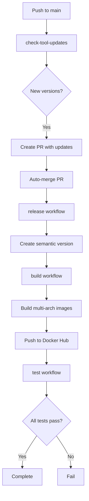
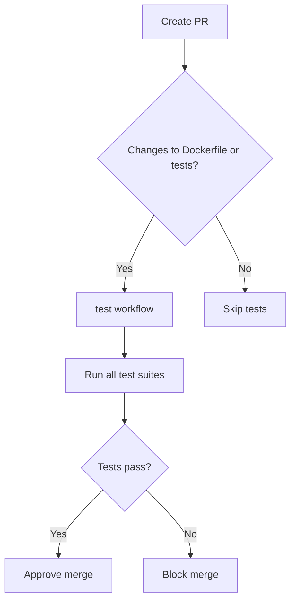

# GitHub Actions Workflows

This directory contains GitHub Actions workflows for building, testing, and releasing the terraform-toolkit Docker image.

## Workflows Overview

### Main CI Workflow (`ci.yaml`)

**Purpose**: Unified continuous integration workflow that orchestrates all quality checks.

**Triggers**:
- Pull requests to main
- Push to main branch
- Manual workflow dispatch

**Jobs**:

1. **lint-pr-title** - Validates PR titles follow conventional commits
2. **pre-commit** - Runs pre-commit hooks (trailing whitespace, YAML, etc.)
3. **dockerfile-lint** - Lints Dockerfile with Hadolint
4. **yaml-lint** - Validates YAML syntax in workflows
5. **markdown-lint** - Checks markdown files for formatting issues
6. **security-gitleaks** - Scans for secrets and credentials
7. **security-codeql** - Static code analysis for security
8. **security-trivy** - Vulnerability scanning of filesystem
9. **dependency-review** - Reviews dependency changes on PRs
10. **test-terraform-configs** - Tests Terraform configurations
11. **test-image** - Calls test-image workflow (conditional)
12. **ci-summary** - Generates comprehensive CI summary

**Workflow**:
```
PR Created
    ├─> lint-pr-title
    ├─> pre-commit
    ├─> dockerfile-lint
    ├─> yaml-lint
    ├─> markdown-lint
    ├─> security-gitleaks
    ├─> security-codeql
    ├─> security-trivy
    ├─> dependency-review
    ├─> test-terraform-configs
    ├─> test-image (if Dockerfile/test changed)
    └─> ci-summary
```

## Workflows Overview

### 1. Build Terraform Toolkit Image (`build-tf-toolkit-image.yaml`)

**Purpose**: Builds multi-architecture Docker images and pushes to Docker Hub.

**Triggers**:
- Push to `main` branch
- Release published
- Manual workflow dispatch

**Jobs**:
1. **build** - Builds images for linux/amd64 and linux/arm64 in parallel
2. **merge** - Merges multi-arch images into a single manifest
3. **test** - Runs test suite on the built image

**Workflow**:
```
build (amd64) ──┐
                 ├─> merge ──> test
build (arm64) ──┘
```

**Environment Variables**:
- `REGISTRY_IMAGE`: Docker Hub repository (ops4life/terraform-toolkit)

**Secrets Required**:
- `DOCKER_USERNAME`: Docker Hub username
- `DOCKER_PASSWORD`: Docker Hub password or access token

### 2. Test Terraform Toolkit Image (`test-image.yaml`)

**Purpose**: Comprehensive testing of all tools in the Docker image.

**Triggers**:
- Pull requests (when Dockerfile or tests change)
- Push to `main` branch
- Manual workflow dispatch (can specify image tag)
- Called by build workflow (reusable workflow)

**Test Jobs**:

#### test-versions
Tests that all tools are installed and accessible:
- Terraform
- Terragrunt
- Checkov
- TFLint
- TFSec
- Trivy
- terraform-docs
- eksctl
- AWS CLI
- pre-commit

#### test-terraform-workflow
Tests complete Terraform lifecycle:
- `terraform init`
- `terraform validate`
- `terraform fmt -check`
- `terraform plan`

#### test-linting
Tests linting tools:
- TFLint initialization
- TFLint execution

#### test-security
Tests security scanning tools:
- TFSec scan
- Checkov scan
- Trivy filesystem scan

#### test-documentation
Tests documentation generation:
- terraform-docs output
- Validates documentation was generated

#### test-terragrunt
Tests Terragrunt functionality:
- Terragrunt plan execution

#### summary
Generates test summary and determines overall status.

**Workflow**:
```
test-versions
      ├─> test-terraform-workflow
      ├─> test-linting
      ├─> test-security
      ├─> test-documentation
      └─> test-terragrunt
             └─> summary
```

**Inputs** (for workflow_dispatch and workflow_call):
- `image_tag`: Docker image tag to test (default: latest)

### 3. Release (`release.yaml`)

**Purpose**: Automated semantic versioning and GitHub release creation.

**Triggers**:
- Push to `main` branch
- Manual workflow dispatch

**Jobs**:
1. **release** - Creates semantic version release
2. **Enhance Release Notes** - Adds Docker image info and tool versions

**Features**:
- Semantic versioning with conventional commits
- Automatic CHANGELOG.md generation
- Enhanced release notes with tool versions
- Docker pull commands

**Secrets Required**:
- `WORKFLOW_TOKEN`: GitHub token with workflow permissions

### 4. Check Tool Updates (`check-tool-updates.yaml`)

**Purpose**: Automatically checks for new tool versions and creates PRs.

**Triggers**:
- Weekly schedule (Monday 00:00 UTC)
- Push to `main` branch
- Manual workflow dispatch

**Features**:
- Fetches latest versions from GitHub releases
- Creates PRs with version updates
- Auto-approves and auto-merges PRs
- Updates Dockerfile ARG values

**Secrets Required**:
- `WORKFLOW_TOKEN`: GitHub token with workflow permissions

### 5. Additional Workflows

- **codeql.yaml** - CodeQL security analysis
- **deps-review.yaml** - Dependency review on PRs
- **gitleaks.yaml** - Secret detection
- **trivy-scan.yaml** - Container vulnerability scanning

## Workflow Integration

### Complete CI/CD Flow



### PR Testing Flow



## Manual Workflow Dispatch

### Test Specific Image Version

```bash
# Via GitHub UI
1. Go to Actions tab
2. Select "Test Terraform Toolkit Image"
3. Click "Run workflow"
4. Enter image tag (e.g., "1.63.4")
5. Click "Run workflow"
```

```bash
# Via gh CLI
gh workflow run test-image.yaml -f image_tag=1.63.4
```

### Trigger Build Manually

```bash
# Via gh CLI
gh workflow run build-tf-toolkit-image.yaml
```

### Create Release Manually

```bash
# Via gh CLI
gh workflow run release.yaml
```

## Local Testing Before CI

Before pushing changes, test locally:

```bash
# Test Docker build
docker build -t terraform-toolkit:test .

# Run test suite
cd test
export DOCKER_IMAGE=terraform-toolkit:test
make test-versions
make init validate
make lint security
```

## Monitoring Workflow Runs

### View Workflow Status

```bash
# List recent workflow runs
gh run list

# View specific workflow run
gh run view <run-id>

# Watch workflow run in real-time
gh run watch <run-id>
```

### Check Build Logs

```bash
# View logs for specific job
gh run view <run-id> --log --job=<job-id>
```

## Troubleshooting

### Build Failures

**Issue**: Multi-arch build fails

**Solutions**:
1. Check Docker Hub credentials are valid
2. Verify both amd64 and arm64 builds complete
3. Check BuildKit cache is accessible
4. Review Dockerfile for syntax errors

### Test Failures

**Issue**: Tests fail in CI but pass locally

**Solutions**:
1. Ensure image is pulled: `docker pull ops4life/terraform-toolkit:latest`
2. Check test configuration matches CI environment
3. Verify all test files are committed
4. Check for platform-specific issues (amd64 vs arm64)

**Issue**: Specific tool test fails

**Solutions**:
1. Check tool installation in Dockerfile
2. Verify tool version is correct
3. Test tool manually: `docker run --rm <image> <tool> --version`

### Release Workflow Issues

**Issue**: Release notes not enhanced

**Solutions**:
1. Check WORKFLOW_TOKEN has proper permissions
2. Verify gh CLI commands work
3. Check Dockerfile ARG values exist
4. Review release.yaml syntax

### Auto-merge Issues

**Issue**: Tool update PRs not auto-merging

**Solutions**:
1. Check WORKFLOW_TOKEN permissions
2. Verify PR approval workflow
3. Check branch protection rules
4. Review check-tool-updates.yaml

## Best Practices

### Before Committing

1. ✅ Test Dockerfile changes locally
2. ✅ Run test suite: `cd test && make test-versions`
3. ✅ Check formatting: `make fmt-check`
4. ✅ Run security scans: `make security`

### PR Guidelines

1. ✅ Update test cases when adding new tools
2. ✅ Update Dockerfile ARG versions
3. ✅ Wait for CI tests to pass before merging
4. ✅ Review test summary in PR checks

### Release Process

1. ✅ Use conventional commit messages
2. ✅ Let semantic-release handle versioning
3. ✅ Verify release notes are enhanced
4. ✅ Confirm Docker images are pushed

## Workflow Permissions

Required GitHub token permissions:

### WORKFLOW_TOKEN
```yaml
permissions:
  contents: write        # Create releases, update files
  pull-requests: write   # Create and merge PRs
  actions: write        # Trigger workflows
```

### GITHUB_TOKEN (default)
```yaml
permissions:
  contents: read
  pull-requests: read
  security-events: write  # For CodeQL
```

## Performance Optimization

### Build Performance

- Uses BuildKit cache for faster builds
- Multi-stage builds minimize image size
- Parallel platform builds (amd64 + arm64)

### Test Performance

- Parallel test execution (6 test suites)
- Reuses Docker image across jobs
- Caches Terraform providers

### Cache Strategy

```yaml
# Build cache by platform
buildcache-linux-amd64
buildcache-linux-arm64

# Provider cache
.terraform/
.terraform.lock.hcl
```

## Cost Considerations

### GitHub Actions Minutes

- Linux runners: Free for public repos
- Build time: ~10-15 minutes
- Test time: ~5-10 minutes
- Total per push: ~15-25 minutes

### Docker Hub

- Public images: Free
- Pull rate limit: 200 pulls/6 hours (anonymous)
- Authenticated: Higher limits

## Adding New Workflows

### Creating New Workflow

1. Create `.github/workflows/new-workflow.yaml`
2. Define triggers and jobs
3. Test with workflow_dispatch first
4. Document in this README
5. Add to workflow integration diagram

### Reusable Workflows

Make workflows reusable with `workflow_call`:

```yaml
on:
  workflow_call:
    inputs:
      param_name:
        required: true
        type: string
```

## References

- [GitHub Actions Documentation](https://docs.github.com/en/actions)
- [Docker Build Push Action](https://github.com/docker/build-push-action)
- [Semantic Release](https://semantic-release.gitbook.io/)
- [Conventional Commits](https://www.conventionalcommits.org/)
