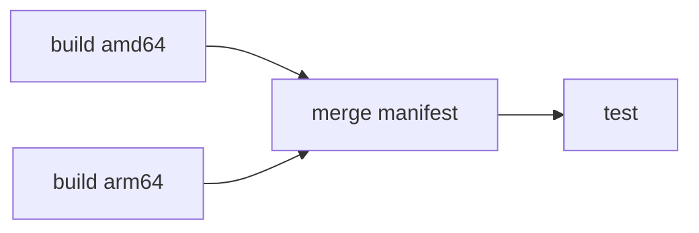
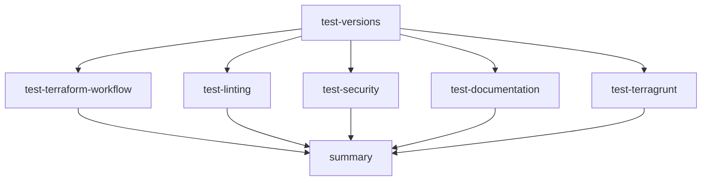
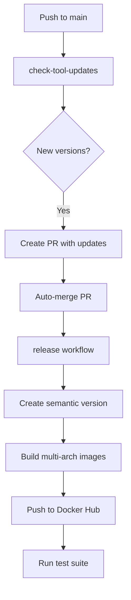

# CI/CD Workflows

This project uses GitHub Actions for automated building, testing, and releasing.

## Workflow Overview

### CI Workflow (`ci.yaml`)

Unified continuous integration that orchestrates all quality checks on pull requests and pushes to main.

**Jobs:**

- **lint-pr-title** - Validates PR titles follow conventional commits
- **pre-commit** - Runs pre-commit hooks
- **dockerfile-lint** - Lints Dockerfile with Hadolint
- **yaml-lint** - Validates YAML syntax
- **markdown-lint** - Checks markdown formatting
- **security-gitleaks** - Scans for secrets and credentials
- **security-codeql** - Static code analysis
- **security-trivy** - Vulnerability scanning
- **dependency-review** - Reviews dependency changes on PRs
- **test-terraform-configs** - Tests Terraform configurations
- **test-image** - Runs image test suite (conditional)

### Build Workflow (`build-tf-toolkit-image.yaml`)

Builds multi-architecture Docker images and pushes to Docker Hub.



**Triggers:** Push to main, release published, manual dispatch

### Test Workflow (`test-image.yaml`)

Comprehensive testing of all tools in the Docker image.



**Test suites:**

- Tool version verification
- Terraform lifecycle (init, validate, fmt, plan)
- TFLint checks
- Checkov and Trivy security scans
- terraform-docs generation
- Terragrunt workflow

### Release Workflow (`release.yaml`)

Automated semantic versioning and GitHub release creation.

- Semantic versioning with conventional commits
- Automatic CHANGELOG.md generation
- Enhanced release notes with tool versions and Docker pull commands

### Tool Updates (`check-tool-updates.yaml`)

Automatically checks for new tool versions weekly (Monday 00:00 UTC).

- Fetches latest versions from GitHub releases
- Creates PRs with version updates
- Auto-approves and auto-merges PRs

## Complete CI/CD Flow



## Manual Dispatch

### Test a Specific Image Version

```bash
gh workflow run test-image.yaml -f image_tag=1.63.4
```

### Trigger a Build

```bash
gh workflow run build-tf-toolkit-image.yaml
```

### Create a Release

```bash
gh workflow run release.yaml
```

## Local Testing Before CI

```bash
# Build the image
docker build -t terraform-toolkit:test .

# Run the test suite
cd test
export DOCKER_IMAGE=terraform-toolkit:test
make test-versions
make init validate
make lint security
```

## Required Secrets

| Secret | Purpose |
|--------|---------|
| `DOCKER_USERNAME` | Docker Hub username |
| `DOCKER_PASSWORD` | Docker Hub password or access token |
| `WORKFLOW_TOKEN` | GitHub token with workflow permissions |
